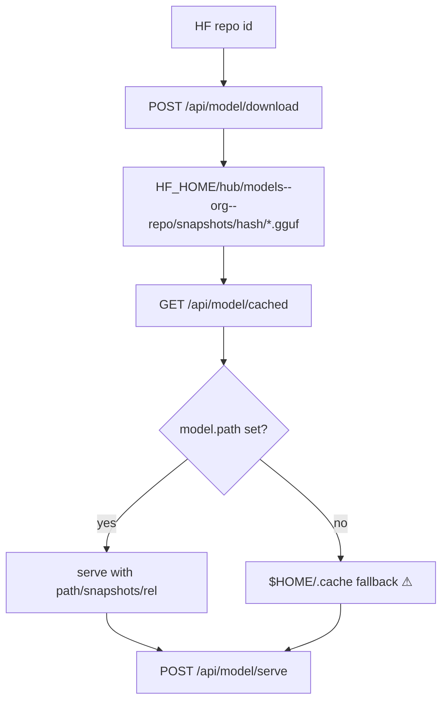

# Cookbook Path, Download & GGUF Setup Audit
**Date:** 2026-06-25  
**Environment:** Windows 11 Enterprise VM (Hyper-V), AMD EPYC 7V12, 8 logical cores, 28 GB RAM, CPU-only (no GPU)  
**Python:** 3.13.5  
**Repository:** Odysseus `dev` branch  
**Audit scope:** Cookbook download flows, GGUF discovery/setup, serve lifecycle, path constants, mis-download / wrong-directory risks

---

## User Request Context

### What was asked
A full codebase scan of Cookbook-related **file pathing**, **model downloading**, **GGUF finding/setup**, and **serve/running** flows — with emphasis on bugs where files land in the wrong place, partial/corrupt downloads, or platform-specific path breakage (especially Windows native).

### Why this matters
Cookbook is the highest-risk cross-platform surface in Odysseus: HuggingFace cache layout, optional remote SSH servers, bash/PowerShell/tmux wrappers, and llama.cpp GGUF resolution must all agree on where artifacts live. A prior Windows audit (2026-06-23) fixed one hardcoded Unix path; this audit goes deeper across download → cache → discover → serve.

### How this audit is organized
Five parallel agent workstreams, each owning a slice of the tree. Findings are appended below by agent ID. Severity uses: 🔴 Critical · 🟠 High · 🟡 Medium · 🟢 Low · ℹ️ Info.

---

## Executive Summary

> **Status:** ✅ **COMPLETE** — all 5 agents reported  
> **Agents dispatched:** 5 · **Completed:** 5 of 5  
> **Issue register:** 50+ rows consolidated below (some deduped across agents)

| Workstream | Agent | Scope | Status |
|------------|-------|-------|--------|
| Download endpoints & HF cache | Agent 1 | `routes/cookbook_routes.py`, download/retry/cancel | ✅ |
| Helpers, shell, path validation | Agent 2 | `routes/cookbook_helpers.py`, `core/platform_compat.py` | ✅ |
| GGUF discovery & serve lifecycle | Agent 3 | `src/cookbook_serve_lifecycle.py`, hwfit, serve presets | ✅ |
| Constants & data-dir conventions | Agent 4 | `src/constants.py`, `runtime_paths`, env overrides | ✅ |
| Cross-cutting paths & test gaps | Agent 5 | grep hardcoded paths, cookbook tests, prior reports | ✅ |

**Top cross-cutting risks:** (1) JS/UI still defaults to Unix `~/.cache/huggingface/hub` while server uses `DATA_DIR/huggingface`; (2) cancel/probe/agent tooling assumes tmux + `python3`, breaking native Windows; (3) WSL split-cache hook exists but is unwired in production.

---

## Agent 0 — Coordinator (Parent)

### Cross-cutting themes

1. **Backend vs frontend path contract is broken on Windows.** Python constants and `launch-windows.ps1` seed `{DATA_DIR}/huggingface`, but multiple JS modules (`cookbook.js`, `cookbookRunning.js`, `cookbookServe.js`, `cookbook-hwfit.js`) default to `~/.cache/huggingface/hub` for display, serve GGUF resolution, and server profiles. Downloads succeed; serve and Running tab point elsewhere.

2. **tmux-centric lifecycle assumptions leak into Windows paths.** Local Windows uses Git Bash detached processes (`_launch_local_detached`), not tmux. Agent `cancel_download`, zombie duplicate checks, hwfit kill buttons, and codex log tails still assume tmux or `/tmp/odysseus-tmux/` — cancel appears to succeed while downloads continue; agents read empty logs.

3. **`python3` hardcoding breaks completion detection on native Windows.** Cache probes in `_cookbook_tasks_status_sync` invoke `python3 -c` locally. Windows typically exposes `python` only. Dead sessions misclassified as `stopped` instead of `completed` even when files exist under `DATA_DIR\huggingface\hub`.

4. **HF cache layout differs by platform; probes are asymmetric.** Scanner (`cookbook_helpers.py`) has a Windows snapshot fallback; status probes (`cookbook_output.py`) check `.incomplete` only in `blobs/`. WSL vs native Windows split-cache is documented (`add_hf_cache`) but never wired in `/api/model/cached`.

5. **Partial fix regression from 2026-06-23.** MiniMax M3 snapshot path fixed in Python (`HUGGINGFACE_HOME`) but `cookbookServe.js:1155` still hardcodes `/home/pewds/.cache/...` — highest-impact user-visible serve bug on Windows VM.

### Recommended Next Steps (prioritized)

| Priority | Fix | Issues |
|----------|-----|--------|
| 1 | Replace `cookbookServe.js:1155` pewds path with backend-derived `HUGGINGFACE_HOME` snapshot (or API endpoint) | A5-001, CB-DL-014 |
| 2 | Extend `_cookbook_kill_session` / agent cancel to use Windows `Stop-Process` tree (mirror `cookbookRunning.js:914-940`) | CB-DL-001, CB-DL-010, CB-DL-015 |
| 3 | Use `sys.executable` or `shutil.which("python")` fallback instead of hardcoded `python3` in cache probes | CB-DL-002, A2-06 |
| 4 | Wire WSL split-cache: when `is_wsl()`, pass `add_hf_cache` with Windows host profile path to `/api/model/cached` | A4-1, A2-05 |
| 5 | Align JS default cache dirs with server config (`ODYSSEUS_DATA_DIR/huggingface/hub`) on first paint; stop prepending `~/.cache` in `_normalizeState` | A5-002, CB-DL-008 |

---

## Agent 1 — Cookbook Routes & Download Flow

_Owner: subagent — routes/cookbook_routes.py download/serve endpoints, HF hub integration, retry logic, state persistence_

### Mandate
- Trace every code path that initiates a model download (local, remote, hf-cli, background job).
- Document which env vars and constants set the download destination (`HF_HOME`, `HUGGINGFACE_HUB_CACHE`, user-supplied `local_dir`, etc.).
- Flag hardcoded paths, Unix-only assumptions, and cases where downloads can land outside `DATA_DIR`.
- Note retry/cancel behavior and partial-file / `.incomplete` handling.

### Findings

#### Executive overview

Cookbook downloads are initiated exclusively via `POST /api/model/download` (`routes/cookbook_routes.py:501-860`). There is **no dedicated cancel/retry/list-downloads route** — cancel/retry are client-side (`/api/model/download` re-POST) or agent tools (`cancel_download`, `list_downloads`) layered on `GET /api/cookbook/tasks/status` and `POST /api/shell/exec`. **bg_jobs is not used** for cookbook downloads (only referenced as a pattern for `_launch_local_detached` at `routes/cookbook_routes.py:445`).

Destination is controlled by **`HF_HOME` + `HUGGINGFACE_HUB_CACHE` + `HF_HUB_CACHE`** (never `snapshot_download(local_dir=…)` on the server path — intentional per issue #2722).

---

#### Download path flow (step-by-step)

##### A. UI / agent initiates download

| Step | Location | Behavior |
|------|----------|----------|
| 1 | `static/js/cookbookDownload.js:511-522` | UI builds payload: `repo_id`, optional `include`, `local_dir` from server `downloadDir`, `disable_hf_transfer` for large/GGUF, `remote_host`, `platform`, `env_prefix` |
| 2 | `src/tool_implementations.py:2723-2787` | Agent `download_model`: POST `/api/model/download` — **does not forward `local_dir`** |
| 3 | `src/tool_implementations.py:2769-2773` | Agent registers task in `cookbook_state.json` via `_cookbook_register_task` — **payload omits `local_dir`, `platform`, `ssh_port`** (`2350-2411`) |

##### B. Server validates and resolves cache root

| Step | Location | Behavior |
|------|----------|----------|
| 4 | `routes/cookbook_routes.py:507-522` | Admin gate; Ollama clears `local_dir`; `_validate_local_dir`, token, remote host/port |
| 5 | `routes/cookbook_routes.py:534-541` | If `local_dir`: `_dl_hf_home_shell = _shell_path(local_dir.rstrip("/"))`. Else: `_shell_path(HUGGINGFACE_HOME)` from `src/constants.py:70` (`DATA_DIR/huggingface` unless `HF_HOME` set) |
| 6 | `routes/cookbook_routes.py:542` | `_dl_pyarg = ""` — **no Python kwargs for include or cache dir** |

**On-disk layout after download:**

```
<HF_HOME>/hub/models--{org}--{name}/blobs/*.incomplete   # partial
<HF_HOME>/hub/models--{org}--{name}/snapshots/{rev}/... # materialized files
```

Where `<HF_HOME>` = `local_dir` (custom) or `HUGGINGFACE_HOME` (default).

##### C. Runner generation (4 branches)

| Branch | Lines | Session / logs | Download command |
|--------|-------|----------------|------------------|
| Remote Windows | `611-690` | `$env:TEMP\odysseus-sessions\{id}.log/.pid/.err.log` on **remote** | PowerShell: `hf download` or `snapshot_download` fallback |
| Remote Linux/Termux | `692-791` | Remote tmux `{id}` | Bash retry loop (10×), `hf download` or `snapshot_download` |
| Local Windows | `827-833`, `443-499` | `%TEMP%\odysseus-tmux\{id}.log/.pid` via `TMUX_LOG_DIR` (`routes/shell_routes.py:399`) | Git Bash detached wrapper (no tmux) |
| Local POSIX | `817-822` | Local tmux `{id}` | Bash retry loop |

Env exports (all HF branches):

```562:564:routes/cookbook_routes.py
            lines.append(f"export HF_HOME={_dl_hf_home_shell}")
            lines.append(f"export HUGGINGFACE_HUB_CACHE={_dl_hf_home_shell}/hub")
            lines.append(f"export HF_HUB_CACHE={_dl_hf_home_shell}/hub")
```

PowerShell mirror: `routes/cookbook_routes.py:624-626`, `634-636`, `702-704`.

##### D. Status / completion detection

| Step | Location | Behavior |
|------|----------|----------|
| 7 | `GET /api/cookbook/tasks/status` `3158-3505` | Loads tasks from `cookbook_state.json`; probes tmux / PID / SSH |
| 8 | `routes/cookbook_output.py:17-40` | `HF_CACHE_*_PROBE` — checks `<cache_root>/hub/models--…/snapshots` + `.incomplete` blobs |
| 9 | `routes/cookbook_routes.py:3172-3220` | Runs probes via **`python3 -c`** locally or over SSH |
| 10 | `routes/cookbook_output.py:43-61` | `classify_dead_download`: `DOWNLOAD_OK` / `DOWNLOAD_FAILED`; "Fetching 0 files" → error |
| 11 | `static/js/cookbookRunning.js:3195-3211` | UI auto-retry on `DOWNLOAD_FAILED` (sets `disable_hf_transfer`, re-POST download) |

##### E. Cancel

| Path | Location | Mechanism |
|------|----------|-----------|
| UI (Windows-aware) | `static/js/cookbookRunning.js:886-941` | `_winSessionStopTreePs` / `Stop-Process` tree |
| Agent | `src/tool_implementations.py:3014-3097` | **`tmux kill-session` only** for local; SSH + tmux for remote |
| UI kill button (hwfit panel) | `static/js/cookbookDownload.js:285` | Hardcoded `tmux kill-session` — **no Windows branch** |

---

#### `cookbook_state.json` & task tracking

| Concern | Location | Detail |
|---------|----------|--------|
| Path | `src/constants.py:33` | `{DATA_DIR}/cookbook_state.json` |
| Read/write API | `routes/cookbook_routes.py:2410-2530` | GET/POST `/api/cookbook/state`; HF token encrypted at rest (`255-271`) |
| Task shape (UI) | `static/js/cookbookRunning.js:798-819` | `{ sessionId, type, payload: { repo_id, local_dir?, … }, remoteHost, sshPort, platform, status, output, ts }` |
| Task shape (agent) | `src/tool_implementations.py:2395-2411` | **Hardcodes `platform: "linux"`, empty `sshPort`, no `local_dir`** |
| Race guard | `routes/cookbook_routes.py:2437-2526` | Preserves disk tasks added within 60s; anti-wipe for `env.servers`; anti-poisoning rejects stale `done` downloads (`2486-2506`) |
| Status reconciliation | `static/js/cookbookRunning.js:3711-3749` | Poll merges server tasks + `/api/cookbook/tasks/status` |
| **bg_jobs** | N/A | Downloads **not** tracked in `bg_jobs.json` / `BG_JOBS_DIR` |

---

#### `routes/cookbook_output.py` relevance

| Item | Lines | Role |
|------|-------|------|
| `HF_CACHE_COMPLETE_PROBE` | `17-29` | Snapshot dir has files AND no `.incomplete` in blobs |
| `HF_CACHE_INCOMPLETE_PROBE` | `31-40` | Any `.incomplete` in blobs |
| Probe cache resolution | `20-21`, `35` | `cache_root/hub` if explicit; else `HUGGINGFACE_HUB_CACHE` → `HF_HOME/hub` → `~/.cache/huggingface/hub` |
| `classify_dead_download` | `43-61` | Marker-based dead-session classification |
| `error_aware_output_tail` | `64-75` | 50-line tail for errors vs 12 for running |

---

#### Findings (by severity)

##### 🔴 Critical

**CB-DL-001 — Agent/UI cancel broken for Windows detached downloads**  
- **Severity:** 🔴  
- **Location:** `src/tool_implementations.py:3062-3064`, `3274-3287`; contrast `static/js/cookbookRunning.js:914-940`  
- **Description:** `_cookbook_kill_session` local branch runs `tmux kill-session`. Local Windows uses `_launch_local_detached` (no tmux). Remote Windows uses `Start-Process` + PID files, not tmux. Cancel appears to succeed ("session not found") while download continues.  
- **Mis-download scenario:** User/agent cancels; partial `.incomplete` blobs remain; retry starts second concurrent download to same cache.

**CB-DL-002 — Cache probes use `python3` on Windows local host**  
- **Severity:** 🔴  
- **Location:** `routes/cookbook_routes.py:3185-3194`, `3208-3217`  
- **Description:** Local probe runs `["python3", "-c", HF_CACHE_COMPLETE_PROBE, …]`. Native Windows often has `python` only (routes already prefer `python` elsewhere, e.g. `657`, `905-908`). Probe fails → dead sessions classified `stopped` instead of `completed` despite files on disk.  
- **Snippet:**

```3185:3194:routes/cookbook_routes.py
            cmd = ["python3", "-c", HF_CACHE_COMPLETE_PROBE, repo_id, cache_root or ""]
            try:
                if remote_host:
                    ...
                else:
                    proc = subprocess.run(cmd, timeout=12, capture_output=True)
```

**CB-DL-003 — Remote Windows stderr split from status log**  
- **Severity:** 🔴  
- **Location:** `routes/cookbook_routes.py:683-684` vs `3305-3309`  
- **Description:** Remote Windows runner redirects stderr to `{session_id}.err.log`; status poller reads only `.log`. Python/pip failures may never appear in `full_snapshot` → stuck `running` or wrong status.

##### 🟠 High

**CB-DL-004 — `snapshot_download` fallback omits `include` / `allow_patterns`**  
- **Severity:** 🟠  
- **Location:** `routes/cookbook_routes.py:542`, `658`, `663`, `756`, `766`  
- **Description:** `hf_cmd` gets `--include` (`548-549`), but `_dl_pyarg` is always empty. Python fallback downloads **entire repo** or wrong files when `hf` CLI missing.  
- **Mis-download scenario:** User requests `*Q4_K_M*` GGUF; fallback pulls full repo to cache; UI may show completed while serve looks for specific quant elsewhere.

**CB-DL-005 — Agent `download_model` ignores server `downloadDir` / `local_dir`**  
- **Severity:** 🟠  
- **Location:** `src/tool_implementations.py:2749-2761`  
- **Description:** UI sends `payload.local_dir = srv.downloadDir` (`cookbookDownload.js:522`); agent never sets `local_dir`. Agent downloads land in default `HUGGINGFACE_HOME` while UI/server config says otherwise.

**CB-DL-006 — Agent task registration omits `local_dir` → wrong cache probe**  
- **Severity:** 🟠  
- **Location:** `src/tool_implementations.py:2404`, `routes/cookbook_routes.py:3413`, `3466`  
- **Description:** Status uses `_payload.get("local_dir") or ""` for probes. Agent-registered tasks lack `local_dir` even when download used custom dir (if added manually to API). Probe checks default cache → false `stopped`.

**CB-DL-007 — UI command preview uses `local_dir=` flat layout; server uses HF cache**  
- **Severity:** 🟠  
- **Location:** `static/js/cookbookDownload.js:136-190` vs `routes/cookbook_routes.py:527-533`  
- **Description:** Preview shows `snapshot_download(..., local_dir=expanduser('…/ModelName'))` (flat tree). Server sets `HF_HOME=<dir>` → `dir/hub/models--…/snapshots/…`. Copy-paste preview lands files in wrong layout; serve/cache scan may not find them.

**CB-DL-008 — UI displays wrong default download directory**  
- **Severity:** 🟠  
- **Location:** `static/js/cookbookRunning.js:2152`  
- **Description:** Shows `Dir: ~/.cache/huggingface/hub` when `payload.local_dir` absent. Server default is `HUGGINGFACE_HOME/hub` → `{DATA_DIR}/huggingface/hub` on Odysseus Windows VM.

**CB-DL-009 — Remote Windows: `disable_hf_transfer` ignored in PowerShell path**  
- **Severity:** 🟠  
- **Location:** `routes/cookbook_routes.py:656-663`  
- **Description:** PS fallback always sets `HF_HUB_ENABLE_HF_TRANSFER = "1"` and installs `hf_transfer`. Retries/UI flag `disable_hf_transfer` not honored → repeated flaky-transfer failures on large files.

**CB-DL-010 — Zombie duplicate probe is tmux-only**  
- **Severity:** 🟠  
- **Location:** `static/js/cookbookDownload.js:569`  
- **Description:** Pre-launch duplicate check runs `tmux has-session`. Fails for local Windows detached and remote Windows → may start second download to same cache dir.

##### 🟡 Medium

**CB-DL-011 — Local Windows: no `< /dev/null` on `hf download`**  
- **Severity:** 🟡  
- **Location:** `routes/cookbook_routes.py:804`  
- **Description:** `_hf_invoke = hf_cmd if IS_WINDOWS else f"{hf_cmd} < /dev/null"`. Git Bash `hf` may block on "update available? [Y/n]" (PS path pipes `$null`, bash remote uses `< /dev/null`).

**CB-DL-012 — `local_dir.rstrip("/")` does not strip Windows trailing `\`**  
- **Severity:** 🟡  
- **Location:** `routes/cookbook_routes.py:535`, `623`  
- **Description:** `D:\models\`.rstrip("/") unchanged. Usually harmless but can produce double separators in edge cases.

**CB-DL-013 — Remote Windows HF_HOME setup silently skipped on exception**  
- **Severity:** 🟡  
- **Location:** `routes/cookbook_routes.py:631-638`  
- **Description:** `except Exception: pass` if `HUGGINGFACE_HOME` import fails → download may use remote user's default HF cache instead of Odysseus-managed path.

**CB-DL-014 — Hardcoded MiniMax M3 snapshot revision**  
- **Severity:** 🟡  
- **Location:** `routes/cookbook_routes.py:307-311`  
- **Description:** Pinned revision `4082acbb…`. New HF revision → serve path broken until code updated (path construction itself is cross-platform via `Path(HUGGINGFACE_HOME)`).

**CB-DL-015 — Hwfit panel kill uses tmux-only**  
- **Severity:** 🟡  
- **Location:** `static/js/cookbookDownload.js:279-286`  
- **Description:** Output-panel kill ignores `_tmuxCmd` / Windows stop tree.

**CB-DL-016 — Session log dir naming split (local vs remote Windows)**  
- **Severity:** 🟡  
- **Location:** Local: `TMUX_LOG_DIR` = `%TEMP%\odysseus-tmux` (`shell_routes.py:399`); Remote: `%TEMP%\odysseus-sessions` (`615`, `3294`)  
- **Description:** Confusing when debugging; paths are consistent within each branch but differ cross-target.

**CB-DL-017 — Bash PATH bootstrap is Unix-centric in all bash runners**  
- **Severity:** 🟡  
- **Location:** `routes/cookbook_routes.py:566`, `715`  
- **Description:** `$HOME/.local/bin`, `/opt/homebrew/bin` — irrelevant on Windows Git Bash; mitigated by `_local_tooling_path_export` for local only (`570-571`).

**CB-DL-018 — `/api/model/cached` scan script hardcodes Unix paths**  
- **Severity:** 🟡  
- **Location:** `routes/cookbook_helpers.py:404`, `489-492`  
- **Description:** `BLOCKED_ROOTS` Unix-only; `~/.cache/huggingface/hub`, `/app/.cache/huggingface/hub` in scanner. Works when Odysseus env sets `HUGGINGFACE_HUB_CACHE` (local scan uses `sys.executable` `909-914`) but misses files in user profile cache if env unset.

##### 🟢 Low

**CB-DL-019 — Agent task hardcodes `platform: "linux"`**  
- **Severity:** 🟢  
- **Location:** `src/tool_implementations.py:2407`  
- **Description:** Windows remote/local tasks from agent may get wrong status/kill/capture branches until UI reconciles from server config.

**CB-DL-020 — `list_downloads` omits download path in output**  
- **Severity:** 🟢  
- **Location:** `src/tool_implementations.py:3262-3268`  
- **Description:** Agent cannot see where files are landing without reading state/tasks payload.

##### ℹ️ Info

**CB-DL-021 — bg_jobs not used for cookbook downloads**  
- **Severity:** ℹ️  
- **Location:** `routes/cookbook_routes.py:445`; `src/constants.py:34`, `47`  
- **Description:** Long downloads use tmux/detached processes + `cookbook_state.json` tasks, not `bg_jobs.json`.

**CB-DL-022 — Partial download / resume design (intentional)**  
- **Severity:** ℹ️  
- **Location:** `routes/cookbook_routes.py:527-533`, `743-775`, `803-816`; `routes/cookbook_output.py:26-27`  
- **Description:** Hub blob cache + `.incomplete` + 10-attempt retry + UI `disable_hf_transfer` on retry is sound **when runners and probes run on the correct platform/path**.

---

#### Suspected bugs / mis-download scenarios (summary)

| # | Scenario | Likely outcome |
|---|----------|----------------|
| 1 | Agent downloads to default cache; user configured `downloadDir` on server | Files in `{DATA_DIR}/huggingface/hub`; serve scans different dir → "model not found" |
| 2 | `hf` CLI missing; Python fallback runs | Full repo or wrong files without `--include` |
| 3 | Cancel download on Windows (agent) | Process keeps running; duplicate on retry |
| 4 | Download completes; probe uses `python3` on Windows | UI shows `stopped`; user retries → redundant download |
| 5 | Remote Windows; errors on stderr | Status stuck `running`; no `DOWNLOAD_FAILED` in polled log |
| 6 | User copies UI preview command | Flat `local_dir` layout vs hub cache → serve/GGUF discovery miss |
| 7 | Custom `local_dir` + agent-registered task | Cache probe checks wrong root → false incomplete/stopped |
| 8 | `Fetching 0 files` with `DOWNLOAD_OK` (mis-filtered include) | Correctly classified `error` (`3437-3439`, `classify_dead_download:56-57`) — but only if marker captured |

---

#### Key file:line index (Agent 1)

| File | Lines | Topic |
|------|-------|-------|
| `routes/cookbook_routes.py` | 501-860 | Download endpoint |
| `routes/cookbook_routes.py` | 443-499 | Local Windows detached launch |
| `routes/cookbook_routes.py` | 862-950 | Cached model scan |
| `routes/cookbook_routes.py` | 2410-2530 | State persistence |
| `routes/cookbook_routes.py` | 3158-3505 | Task status / probes |
| `routes/cookbook_output.py` | 17-75 | Cache probes + classification |
| `routes/cookbook_helpers.py` | 113-148 | `local_dir` validation / shell paths |
| `routes/cookbook_helpers.py` | 396-567 | Cache scanner script |
| `routes/cookbook_helpers.py` | 1023-1033 | `ModelDownloadRequest` |
| `routes/shell_routes.py` | 399 | `TMUX_LOG_DIR` |
| `src/constants.py` | 33, 70-71 | State file + HF paths |
| `src/tool_implementations.py` | 2350-2411, 2723-2787, 3014-3287 | Agent register/download/cancel/list |
| `static/js/cookbookDownload.js` | 124-203, 480-626 | Preview + launch |
| `static/js/cookbookRunning.js` | 886-941, 1347-1395, 2152, 3195-3211 | Kill/retry/status UI |

---

## Agent 2 — Cookbook Helpers, Shell & Path Validation

_Owner: subagent — cookbook_helpers, platform_compat, PowerShell/bash/tmux wrappers_

### Mandate
- Audit path validation regexes (Windows vs Unix), shell command building, and cache scanning helpers.
- Trace how downloaded artifacts are discovered after the fact (snapshot paths, blobs vs snapshots on Windows HF cache).
- Document tmux/PowerShell/Git-Bash branching and failure modes on Windows without tmux.

### Findings

#### 1. Path validation (`_LOCAL_DIR_RE`, `_WINDOWS_*`)

**Regex definitions** — `routes/cookbook_helpers.py:52-54`

```52:54:routes/cookbook_helpers.py
_LOCAL_DIR_RE = re.compile(r"^~?(?:/[\w. -]*)+$|^~$")
_WINDOWS_LOCAL_DIR_RE = re.compile(r"^[A-Za-z]:[\\/](?:[\w. -]+(?:[\\/][\w. -]+)*[\\/]?)?$")
_WINDOWS_DRIVE_PATH_RE = re.compile(r"^[A-Za-z]:[\\/]")
```

**Validator pipeline** — `routes/cookbook_helpers.py:113-129`

| Step | Behavior |
|------|----------|
| Strip outer quotes | `'` / `"` wrapper removed |
| `rstrip("/")` | Strips **forward slash only** — trailing `\` on Windows paths preserved |
| Regex gate | Must match `_LOCAL_DIR_RE` **or** `_WINDOWS_LOCAL_DIR_RE` |
| Segment guard | Any path segment starting with `-` rejected (CLI option injection) |

**`_shell_path`** — `routes/cookbook_helpers.py:140-148`: wraps validated path in double quotes; expands leading `~` → `"$HOME"`. Used in bash download runners for `HF_HOME` / cache env vars. Does **not** convert drive letters to Git Bash POSIX form (unlike `_local_tooling_path_export`).

**Tests** — `tests/test_cookbook_helpers.py:110-190` cover spaces, Unicode, metachar rejection, dash segments. No tests for UNC, `~\`, or drive-only roots.

---

#### 2. `core/platform_compat.py` — Windows / bash / SSH

| Symbol | Location | Role in Cookbook |
|--------|----------|------------------|
| `IS_WINDOWS` | `core/platform_compat.py:25` | Gates local detached-process path vs tmux |
| `find_bash()` | `core/platform_compat.py:233-255` | Probes PATH + Git-for-Windows install roots; rejects WSL/store stubs (`system32\bash.exe`, `windowsapps\bash.exe`) |
| `git_bash_path()` | `core/platform_compat.py:219-230` | Drive → `/c/...` (used by shell routes) |
| `_ssh_exec_argv()` | `core/platform_compat.py:494-524` | argv-based SSH (used by `run_ssh_command_async` in helpers) |
| `SSH_PATH_OVERRIDE` | `core/platform_compat.py:180-186` | Remote GPU probe PATH — **Linux/WSL paths only** |
| `get_wsl_windows_user_profile()` | `core/platform_compat.py:470-491` | WSL → Windows `%USERPROFILE%` — **not wired into cache scan** |
| `pid_alive()` / `kill_process_tree()` | `core/platform_compat.py:75-141` | Local Windows task liveness + stop |
| `detached_popen_kwargs()` | `core/platform_compat.py:58-72` | Detached child for `_launch_local_detached` |

**Duplicate path helper:** `cookbook_helpers._git_bash_path` (`routes/cookbook_helpers.py:57-62`) vs `platform_compat.git_bash_path` — parallel implementations; only `_local_tooling_path_export` uses the local copy.

---

#### 3. Windows HF cache — snapshots vs blobs

**Scanner logic** — embedded in `_cached_model_scan_script()` → `scan_hf()` (`routes/cookbook_helpers.py:449-479`):

```463:471:routes/cookbook_helpers.py
        "        # Windows HF cache stores files directly in snapshots/; blobs/ may be empty."
        "        # Fallback: scan snapshots for real files when blobs yielded nothing."
        "        if sz == 0 and os.path.isdir(snap):"
        "            for sd in os.listdir(snap):"
        "                sf = os.path.join(snap, sd)"
        "                if not os.path.isdir(sf): continue"
        "                for f in os.scandir(sf):"
        "                    if f.is_file(): nf += 1; sz += f.stat().st_size"
        "                    if f.name.endswith('.incomplete'): ic = True"
```

| Layout | Size / file count | Incomplete detection |
|--------|-------------------|----------------------|
| Linux/WSL blob store | Primary: `blobs/` | `.incomplete` in `blobs/` |
| Windows snapshot-heavy | Fallback when `blobs/` empty | `.incomplete` in snapshot subdirs |
| GGUF / diffusion metadata | Always from `snapshots/<rev>/` | — |

**Gap — status probes** (`routes/cookbook_output.py:17-39`): `HF_CACHE_COMPLETE_PROBE` checks snapshot dirs + `blobs/*.incomplete`; `HF_CACHE_INCOMPLETE_PROBE` checks **only** `blobs/*.incomplete`. On Windows-native caches with files in snapshots and no blob incomplete markers, a dead session can be misclassified as **completed** while partial snapshot files remain.

**Gap — WSL split cache:** `add_hf_cache` parameter exists (`routes/cookbook_helpers.py:396-398,493`) and is tested (`tests/test_cookbook_helpers.py:880-908`), but `model_cached` never passes `get_wsl_windows_user_profile()` + `\.cache\huggingface\hub` — WSL Odysseus won't list models downloaded to the Windows host HF cache. *(Deduped with A4-1 in issue register.)*

**Gap — `model_dir` on `/api/model/cached`:** comma-split paths appended via `{model_dir!r}` (`routes/cookbook_helpers.py:564-565`) without `_validate_local_dir` — safe from shell injection (Python repr), but can scan paths download would reject (UNC, relative, etc.).

---

#### 4. Path validation — false rejects / false accepts

##### Valid paths rejected (🟡 Medium)

| Path example | Reason |
|--------------|--------|
| `\\server\share\models` | UNC — neither regex matches |
| `~\Documents\models` | Windows tilde — `_LOCAL_DIR_RE` requires `~/` with `/` |
| `D:` (drive root, no separator) | `_WINDOWS_LOCAL_DIR_RE` requires `:` + `\` or `/` |
| `/mnt/c/Users/...` from UI on native Windows | POSIX `/mnt/...` only matches `_LOCAL_DIR_RE` — works in Git Bash, odd for native Win UI |

##### Paths accepted that may surprise operators (🟢 Low / ℹ️)

| Path | Note |
|------|------|
| `D:\` | Regex allows drive + separator + empty segments |
| `D:/mixed\path` | Mixed separators allowed |
| Unicode segments (`D:\Модели`) | `\w` is Unicode-aware — by design (`routes/cookbook_helpers.py:46-48`) |

##### Wrong-directory / inconsistency risks (🟡 Medium)

1. **`_shell_path` vs Git Bash:** `HF_HOME="D:\models"` in bash script while PATH export uses `/c/...` POSIX form — usually works but inconsistent; edge cases with `\` sequences in double-quoted bash strings.
2. **`model_dir` bypass:** Serve scanner can walk directories blocked for download `local_dir`.
3. **`rstrip("/")` only:** `D:\models\` keeps trailing backslash; forwarded to PowerShell remote as-is (generally OK).

---

#### 5. Shell branching — download & serve logs

##### Decision tree (both flows)

```
remote?
├─ yes + platform=windows → .ps1 + Start-Process → $env:TEMP\odysseus-sessions\{id}.log
├─ yes + platform≠windows → bash .sh + tmux new-session → tmux capture-pane
└─ no (local)
   ├─ IS_WINDOWS → _launch_local_detached (Git Bash) → %TEMP%\odysseus-tmux\{id}.log
   └─ else → bash .sh + tmux new-session → tmux capture-pane
```

**tmux gate** — skipped when `local_windows = IS_WINDOWS and not remote` (`routes/cookbook_routes.py:599-601,1404-1406`). Remote Windows uses PowerShell, not tmux.

##### Download branches (`routes/cookbook_routes.py:501-860`)

| Branch | Runner | Log sink | Progress / completion markers |
|--------|--------|----------|-------------------------------|
| Local POSIX | bash → tmux | tmux pane | `DOWNLOAD_OK` / `DOWNLOAD_FAILED`; `< /dev/null` on hf |
| Local Windows | bash via `_launch_local_detached` | `%TEMP%\odysseus-tmux\{id}.log` | Same markers; **no** `< /dev/null` on hf (`:804`) |
| Remote Linux | scp bash → remote tmux | remote tmux pane | Retry loop + markers |
| Remote Windows | scp `.ps1` → Start-Process | `$env:TEMP\odysseus-sessions\{id}.log` | PowerShell `DOWNLOAD_OK` / `DOWNLOAD_FAILED` |

**`_launch_local_detached`** — `routes/cookbook_routes.py:443-499`: requires `find_bash()`; without Git Bash writes stub `.cmd` error to log (`476-485`). PID file records **launcher** PID; inner bash PID written inside `_run.sh` — UI stop uses `Stop-Tree` (`tests/test_cookbook_helpers.py:712-719`).

##### Serve branches (`routes/cookbook_routes.py:1318-1883`)

| Branch | Persistent log | Post-crash shell | Crash watchdog |
|--------|----------------|------------------|----------------|
| Local POSIX / remote Linux | `tee` → `/tmp/odysseus-tmux/{id}.log` (`1490-1493`) | Interactive bash (`keep_shell_open=True`) | Active (`1060-1152`) |
| Local Windows | Outer redirect only → `%TEMP%\odysseus-tmux\{id}.log` | **No** interactive shell (`1815-1822`) | **Skipped** (`1091-1093`) |
| Remote Windows | `$env:TEMP\odysseus-sessions\{id}.log` | N/A | N/A (SSH poll) |

##### Status polling (`routes/cookbook_routes.py:3272-3474`)

| Context | Liveness | Output source |
|---------|----------|---------------|
| Local Windows | `pid_alive(TMUX_LOG_DIR/{id}.pid)` | Read `{id}.log` directly |
| Local POSIX | `tmux has-session` | `tmux capture-pane -S -500` |
| Remote Windows | SSH PowerShell Get-Process on pid file | SSH Get-Content log tail |
| Remote Linux | SSH tmux has-session | SSH capture-pane |

**Cache fallback probes** use hardcoded `python3` (`routes/cookbook_routes.py:3185,3208`) — on native Windows without `python3` on PATH, dead-download cache checks silently fail → tasks stuck as **stopped** instead of **completed**. *(Deduped with CB-DL-002 in issue register.)*

##### Agent / codex log tail mismatch (🟠 High on Windows VM)

- UI (`static/js/cookbookRunning.js:898-941`) correctly uses `$env:TEMP\odysseus-tmux\...` for local Windows.
- Agent paths hardcode Unix log: `routes/codex_routes.py:582-585`, `src/tool_implementations.py:2867,3177` → `/tmp/odysseus-tmux/{id}.log`.
- Local Windows serve **never** writes to `/tmp/odysseus-tmux/` — agent `tail_serve_output` / `codex_cookbook_output` miss real logs on Hyper-V VM.

---

#### 6. PowerShell escaping & env_prefix bug

**`_ps_squote`** — `routes/cookbook_helpers.py:570-574`: `'` → `''` for single-quoted PS strings. Used for tokens, repo_id, local_dir on remote Windows.

**`_safe_env_prefix`** — `routes/cookbook_helpers.py:1111-1161`: emits **bash** `[ -f "path" ] && source "path"` or bash conda hooks. PowerShell venv activation (`& '...\Activate.ps1'`) passes through correctly (`1143-1149`).

**🟠 Bug:** Remote Windows download/serve append `_safe_env_prefix()` into `.ps1` runners (`routes/cookbook_routes.py:639-640,1436-1437`) — bash `source` syntax is invalid PowerShell → venv/conda activation silently no-ops or errors.

---

#### 7. Failure scenarios — Windows 11 VM, no tmux, CPU-only

| Scenario | Expected behavior | Failure mode |
|----------|-------------------|--------------|
| Git Bash installed | Detached bash wrapper; log under `%TEMP%\odysseus-tmux` | Works for UI status poll |
| No Git Bash | Stub `.cmd` writes install message to log | Download/serve fail immediately with clear log |
| hf CLI missing | pip fallback chain in bash (`_pip_install_fallback_chain`) | May fail if `python3` resolves to Store stub — mitigated by `_user_shell_path_bootstrap` (`379-393`) |
| vLLM serve | Bash runner has no Windows block; vLLM preflight is Linux-oriented | Serve fails — diagnosis suggests llama.cpp/Ollama (`_diagnose_serve_output`) |
| Agent tails serve log | codex uses `/tmp/odysseus-tmux/...` | **Empty/wrong output** — HIGH |
| Dead download, no DOWNLOAD_OK in log | Cache probe with `python3` | May stay **stopped** if `python3` missing |
| Remote Windows + `env_prefix: source ~/venv/...` | Bash snippet in PS1 | Activation fails — HIGH |
| WSL scanning Windows HF cache | No `add_hf_cache` wiring | Models invisible in Serve picker |

---

#### 8. Auxiliary helpers (brief)

| Helper | Lines | Notes |
|--------|-------|-------|
| `_user_shell_path_bootstrap` | 379-393 | WindowsApps `python3` stub workaround |
| `_local_tooling_path_export` | 151-179 | venv `hf`/`python` on PATH for tmux/bash |
| `_pip_install_attempt` / fallback | 197-299 | Bash-only; grep/venv detection |
| `_validate_serve_cmd` | 701-746 | Allowlist + GGUF prelude exception |
| `WIN_SESSION_DIR` | 1171 | Remote Windows session dir constant (unused in routes — inline `$env:TEMP\odysseus-sessions`) |

---

## Agent 3 — GGUF Discovery, Setup & Serve Lifecycle

_Owner: subagent — cookbook_serve_lifecycle, hwfit, model routes integration_

### Mandate
- Trace GGUF file resolution: from HF repo → local snapshot → serve command path passed to llama.cpp.
- Document preset generation, mmproj/vision sidecars, and adopt-served-model flows.
- Flag mismatches between where downloads land and where serve looks for files.

### Findings

**8 issues logged (A3-01–A3-08).** Note: `cookbook_serve_lifecycle.py` handles **scheduled stop only** (tmux kill + endpoint cleanup) — not GGUF path resolution.

#### End-to-end: HF repo → disk → llama.cpp

| Phase | Endpoint / module | Behavior |
|-------|-------------------|----------|
| Discover | hwfit + `hf-latest` / `hf-gguf-files` | Catalog, VRAM fit, profile generation |
| Download | `POST /api/model/download` | `hf download` with `HF_HOME={local_dir or HUGGINGFACE_HOME}` → `{hub}/models--{org}--{repo}/snapshots/{hash}/*.gguf` |
| Scan | `GET /api/model/cached` | Ephemeral `scan_cache.py` — probes process env only (`HUGGINGFACE_HUB_CACHE`, `HF_HOME/hub`, `~/.cache`, `/app/.cache`) |
| Serve cmd | `cookbookServe.js` | `_selectedGgufExpr` uses `model.path` when set; else **`$HOME/.cache/huggingface/hub/...`** |
| Launch | `POST /api/model/serve` | llama-server / `llama_cpp.server` → auto-register endpoint |

#### Highest-risk mismatch (Windows VM)

Downloads land at `{DATA_DIR}/huggingface/hub`. Cache scan subprocess may not see that path if `HF_HOME` unset in Odysseus process. Serve fallback uses `$HOME/.cache` → **"No GGUF found" despite successful download.**

#### Wrong-file serve risks

- `find … '*.gguf' | sort | head -1` — lexicographic first quant, not user choice
- mmproj: first sorted `mmproj*.gguf` may mismatch vision encoder
- Presets store frozen shell commands — stale after re-download or cache move
- `serve_preset` substring match can launch unintended preset

_See A3-* rows in Issue Register and Appendix B._

---

## Agent 4 — Constants, Runtime Paths & Data Directory Conventions

_Owner: subagent — src/constants.py, runtime_paths, launch-windows.ps1 env seeding_

### Mandate
- Map every Cookbook-relevant constant to its env override and default under `DATA_DIR`.
- Compare Docker (`/app/data`, `/app/.cache/huggingface`) vs native Windows vs WSL split-cache scenarios.
- Identify duplicate or conflicting path sources (e.g. `HF_HOME` set in launcher but not in route handler).

### Findings

#### Architecture: single source of truth

All persisted paths flow through `src/constants.py`, which reads `ODYSSEUS_DATA_DIR` exactly once:

```12:12:src/constants.py
DATA_DIR = os.getenv("ODYSSEUS_DATA_DIR", get_default_data_dir())
```

`get_default_data_dir()` (`src/runtime_paths.py`):
- **Source run:** `{repo_root}/data`
- **Frozen PyInstaller build:** `~/.odysseus/data`
- **Docker (no override):** `/app/data` (repo root inside container)

`core/constants.py` is a re-export shim only.

---

#### Master table: Cookbook-relevant constants

| Constant | Env override | Native Windows default | macOS default | Docker in-container path | Docker host bind |
|----------|--------------|------------------------|---------------|--------------------------|------------------|
| `DATA_DIR` | `ODYSSEUS_DATA_DIR` | `{repo}/data` (launcher seeds) | `{repo}/data` | `/app/data` | `${APP_DATA_DIR:-./data}` → `/app/data` |
| `COOKBOOK_STATE_FILE` | — | `{DATA_DIR}/cookbook_state.json` | same | `/app/data/cookbook_state.json` | under `./data/` |
| `BG_JOBS_FILE` | — | `{DATA_DIR}/bg_jobs.json` | same | `/app/data/bg_jobs.json` | under `./data/` |
| `BG_JOBS_DIR` | — | `{DATA_DIR}/bg_jobs/` | same | `/app/data/bg_jobs/` | under `./data/` |
| `HUGGINGFACE_HOME` | **`HF_HOME`** | `{DATA_DIR}/huggingface` | same | `/app/data/huggingface` | `./data/huggingface/` (via data mount) |
| `HUGGINGFACE_HUB_CACHE` | **`HUGGINGFACE_HUB_CACHE`** | `{HF_HOME}/hub` | same | `/app/data/huggingface/hub` | `./data/huggingface/hub/` |
| `OLLAMA_HOME` | `OLLAMA_HOME` | `{DATA_DIR}/ollama` | `{DATA_DIR}/ollama` (constant only; binary usually Homebrew) | `/app/data/ollama` | under `./data/` |
| `OLLAMA_BIN` | `OLLAMA_BIN` | `OLLAMA_HOME` (nt) | `{OLLAMA_HOME}/bin` | `/app/data/ollama` | under `./data/` |
| `FASTEMBED_CACHE_DIR` | **`FASTEMBED_CACHE_PATH`** | `{DATA_DIR}/fastembed_cache` | same | `/app/data/fastembed_cache` | under `./data/` |
| `CHROMA_DIR` | — | `{DATA_DIR}/chroma` | same (macOS script starts chroma here) | `/app/data/chroma` | under `./data/` |
| ChromaDB **client** host | `CHROMADB_HOST` | `localhost` | `localhost` | **`chromadb`** (compose override) | — |
| ChromaDB **client** port | `CHROMADB_PORT` | **`8100`** | **`8100`** | **`8000`** (compose override) | host `8100` → container `8000` |
| `TMUX_LOG_DIR` | — | `%TEMP%\odysseus-tmux` | `$TMPDIR/odysseus-tmux` | `/tmp/odysseus-tmux` | **not persisted** |
| Cookbook SSH keys (Docker) | — | N/A | N/A | `/app/.ssh` | `${APP_DATA_DIR}/ssh` |
| pip `--user` installs (Docker) | — | N/A | N/A | `/app/.local` | `${APP_DATA_DIR}/local` |
| HF cache **alias mount** (Docker) | — | N/A | N/A | `/app/.cache/huggingface` | `${APP_DATA_DIR}/huggingface` |

**Naming note:** Python never reads `APP_DATA_DIR` / `APP_LOGS_DIR` — those are compose-only host-path knobs. Inside the container, `DATA_DIR` defaults to `/app/data` with no `ODYSSEUS_DATA_DIR` in compose env.

---

#### Platform launcher comparison

##### Native Windows — `launch-windows.ps1` (lines 27–31)

Seeds before venv/setup/uvicorn:

```powershell
ODYSSEUS_DATA_DIR → {repo}/data
HF_HOME            → {ODYSSEUS_DATA_DIR}/huggingface
HUGGINGFACE_HUB_CACHE → {HF_HOME}/hub
OLLAMA_HOME        → {ODYSSEUS_DATA_DIR}/ollama
OLLAMA_BIN         → {OLLAMA_HOME}
```

Also prepends Ollama dir to `PATH` after install check.

**Does uvicorn inherit correct paths?** **Yes**, with caveats:
- Env is set in the PowerShell session **before** `Start-Process` (line 338).
- `Start-Process` without `-UseNewEnvironment` inherits the parent environment block.
- `src/constants.py` is evaluated at import: `HUGGINGFACE_HOME = os.getenv("HF_HOME", join(DATA_DIR, "huggingface"))` — launcher-set `HF_HOME` and `ODYSSEUS_DATA_DIR` align.
- `load_dotenv()` in `app.py` does **not** override existing env vars, so launcher values win over `.env`.
- **Gap:** Direct `python -m uvicorn` (no launcher) still gets correct **Python constants** via `DATA_DIR` defaults, but child shells (`hf download` tmux/bash) won't see `HF_HOME` unless set in `.env` or OS env.

##### macOS — `start-macos.sh`

- Loads `.env` for `APP_PORT` / `APP_BIND` only.
- **Does not** seed `ODYSSEUS_DATA_DIR`, `HF_HOME`, `OLLAMA_HOME`, or `HUGGINGFACE_HUB_CACHE`.
- Relies on `src/constants.py` defaults (`{repo}/data/...`).
- Starts local ChromaDB explicitly: `--path "$PWD/data/chroma"` on port `8100`.
- Runs uvicorn in-process (`"$VENV_PY" -m uvicorn ...`) — inherits shell env + `.env`.

##### Docker — `docker-compose.yml`

Volume mounts:

| Host | Container | Purpose |
|------|-----------|---------|
| `${APP_DATA_DIR:-./data}` | `/app/data` | All `DATA_DIR` persistence |
| `${APP_LOGS_DIR:-./logs}` | `/app/logs` | Container logs (setup creates `BASE_DIR/logs`) |
| `${APP_DATA_DIR}/ssh` | `/app/.ssh` | Cookbook remote-server SSH identity |
| `${APP_DATA_DIR}/huggingface` | **`/app/.cache/huggingface`** | HF cache alias for `HOME=/app` convention |
| `${APP_DATA_DIR}/local` | `/app/.local` | Cookbook `pip install --user` artifacts |
| `chromadb-data` (named vol) | `/chroma/chroma` | ChromaDB service data (separate from `CHROMA_DIR`) |

Compose env **does not** set `ODYSSEUS_DATA_DIR`, `HF_HOME`, or `HUGGINGFACE_HUB_CACHE`. Cookbook downloads use `HUGGINGFACE_HOME` constant → `/app/data/huggingface`, hub at `/app/data/huggingface/hub`. The alias mount puts the **same host directory** at `/app/.cache/huggingface`, so `/app/.cache/huggingface/hub` ≡ host `./data/huggingface/hub` — persistence works, but two in-container paths refer to one host tree (confusing for debugging).

Entrypoint (`docker/entrypoint.sh`) sets `PATH=/app/.local/bin:$PATH`, runs `setup.py` as app user, then `gosu` → uvicorn. No HF env seeding.

---

#### Env var conflicts & documentation drift

| Issue | Severity | Detail |
|-------|----------|--------|
| **`HF_HOME` vs `HUGGINGFACE_HOME`** | ℹ️ By design | Constant is named `HUGGINGFACE_HOME` but reads **`HF_HOME`** (HF ecosystem convention). `HUGGINGFACE_HUB_CACHE` is separate. Download runners export all three: `HF_HOME`, `HUGGINGFACE_HUB_CACHE`, `HF_HUB_CACHE` (`cookbook_routes.py` ~562–564). |
| **Docker HF dual-path** | 🟡 Medium | Downloads target `/app/data/huggingface/hub`; scanner also probes `/app/.cache/huggingface/hub` (`cookbook_helpers.py` ~490–492). Same host files, different container paths. |
| **`FASTEMBED_CACHE_PATH` empty string** | 🟠 High (fixed in code) | Compose injects `FASTEMBED_CACHE_PATH=${FASTEMBED_CACHE_PATH:-}` → empty string. `constants.py` uses `os.getenv(...) or join(DATA_DIR, "fastembed_cache")` (not default arg) — see comment lines 60–66. `.env.example` line 137 still says "defaults to ~/.cache/fastembed" — **stale**. |
| **ChromaDB port split** | 🟡 Medium | Native: client `8100`, data in `{DATA_DIR}/chroma`. Docker: client `8000` (service), host port `8100`, Chroma data in **named volume** `chromadb-data`, not `CHROMA_DIR`. |
| **`APP_DATA_DIR` vs `ODYSSEUS_DATA_DIR`** | 🟡 Medium | Compose host binds use `APP_DATA_DIR`; Python uses `ODYSSEUS_DATA_DIR`. No bridge — operators must keep `./data` aligned manually. |
| **Logs path split** | 🟢 Low | Docker mounts `/app/logs`; diagnostics uses `DATA_DIR/logs` (`diagnostics_routes.py`). Launcher/setup use `{repo}/data/logs` vs `setup.py` creating `{repo}/logs`. |
| **`TMUX_LOG_DIR` ephemeral** | ℹ️ | `tempfile.gettempdir()/odysseus-tmux` — download wrapper scripts, scan scripts, session logs **not** under `DATA_DIR`. Survives reboot only if temp persists. |

---

#### WSL split-cache scenario

Documented in `routes/cookbook_helpers.py`:

```396:398:routes/cookbook_helpers.py
def _cached_model_scan_script(model_dirs: list[str] | None = None, add_hf_cache: str | None = None) -> str:
    """Build the standalone Python scanner used by /api/model/cached.
    Allows for an additional HuggingFace cache path to be scanned (i.e. Windows HF cache for local WSL envs.)
```

**Scanner probe order** (`hf_cache_paths()` embedded script):
1. `HUGGINGFACE_HUB_CACHE`
2. `{HF_HOME}/hub`
3. `~/.cache/huggingface/hub` (WSL Linux home)
4. `/app/.cache/huggingface/hub` (Docker)
5. `add_hf_cache` argument (optional extra root)

**Split-cache problem:** Odysseus in WSL downloads to `~/.cache/huggingface/hub` (Linux). A parallel **Windows-native** run (or Windows-side HF tools) caches under `%USERPROFILE%\.cache\huggingface\hub` → WSL path `/mnt/c/Users/<user>/.cache/huggingface/hub`. The scanner won't see the Windows cache unless:
- env points at it, or
- `add_hf_cache` is passed.

**Critical gap:** `add_hf_cache` is **only used in tests** (`test_cached_model_scan_runs_additional_hf_cache`). Production `/api/model/cached` calls `_cached_model_scan_script(model_dirs)` **without** `add_hf_cache` (`cookbook_routes.py` ~879). `get_wsl_windows_user_profile()` exists in `core/platform_compat.py` but is **never wired** to model scanning.

**Recommended fix:** When `is_wsl()`, auto-append `/mnt/c/Users/<profile>/.cache/huggingface/hub` via `add_hf_cache` or env seeding at startup.

---

#### `launch-windows.ps1` → uvicorn inheritance trace

```
launch-windows.ps1 sets $env:* (lines 27–31)
  → setup.py (inherits env; creates DATA_DIR subdirs, not huggingface/ollama)
  → Start-Process $venvPy -m uvicorn ... (line 338, inherits env)
    → app.py: HF_HUB_DISABLE_SYMLINKS on nt (lines 37–39)
    → load_dotenv (does not override existing)
    → import src.constants (reads ODYSSEUS_DATA_DIR, HF_HOME, ...)
    → cookbook_routes uses HUGGINGFACE_HOME for download command building
```

Download tmux/bash wrappers **re-export** `HF_HOME`/`HUGGINGFACE_HUB_CACHE` explicitly — they do not rely on uvicorn's inherited env surviving into tmux (fresh shell, explicit exports in wrapper script).

---

#### Appendix — key file references (Agent 4)

| File | Lines | Role |
|------|-------|------|
| `src/constants.py` | 12–82 | All path constants |
| `src/runtime_paths.py` | 20–30 | `get_default_data_dir()` |
| `launch-windows.ps1` | 27–31, 338 | Env seeding + uvicorn spawn |
| `start-macos.sh` | 209, 266 | Chroma local path; uvicorn (no HF seed) |
| `docker-compose.yml` | 6–18, 42–55 | Volume mounts + Chroma/FastEmbed env |
| `docker/entrypoint.sh` | 99–101, 136 | Mount repair; PATH for `.local` |
| `routes/cookbook_routes.py` | 527–564, 879 | Download HF env exports; cached scan |
| `routes/cookbook_helpers.py` | 396–494 | Scanner + WSL comment |
| `routes/cookbook_output.py` | 17–35 | HF cache completion probes |
| `app.py` | 37–39 | Windows symlink disable |

---

## Agent 5 — Cross-Cutting Issues, Hardcoded Paths & Test Coverage

_Owner: subagent — repo-wide grep, tests, prior dev_log reports_

### Mandate
- Grep for hardcoded `/home/`, `/app/`, `~/.cache/huggingface`, relative `"data/"` literals in cookbook-adjacent code.
- Inventory existing tests (`test_cookbook*`, `test_hwfit*`, Windows cookbook tests) and gaps.
- Cross-reference 2026-06-18 dependency report and 2026-06-23 Windows report for unfixed items.

### Findings

**Scope:** Repo-wide grep (`/home/`, `/app/`, `~/.cache`, `data/huggingface`, `pewds`, hardcoded `snapshots/`), prior dev_log reports, test inventory, JS UI path assumptions.

---

#### 1. Hardcoded path grep — cookbook-adjacent hits

##### 🔴 Critical / unfixed (user-visible breakage)

| Location | Pattern | Risk |
|----------|---------|------|
| `static/js/cookbookServe.js:1155` | `const _minimaxM3Snapshot = '/home/pewds/.cache/huggingface/hub/models--cyankiwi--MiniMax-M3-AWQ-INT4/snapshots/4082acbbec1236d21828d55b6bb0fe02ade4ab5b'` | **Backend fixed** in `routes/cookbook_routes.py:307–309` (uses `HUGGINGFACE_HOME`), but **frontend Serve preset still hardcodes pewds Unix path**. MiniMax M3 serve on Windows native will pre-fill a non-existent path in the UI and may launch llama.cpp against it unless user overrides. |

This is a **partial fix regression**: 2026-06-23 report marked the issue resolved at commit 7c13a3b, but only the Python route was updated; JS was missed.

##### 🟠 High — Unix-default fallbacks in client shell builders

These are intentional for **remote SSH/bash** targets but wrong as **display defaults** on Windows native / Docker-local where cache is under `ODYSSEUS_DATA_DIR/huggingface`:

| File | Lines (approx.) | Pattern |
|------|-------------------|---------|
| `static/js/cookbookServe.js` | 806, 812 | `$HOME/.cache/huggingface/hub/models--…/snapshots/…` when `model.path` absent |
| `static/js/cookbook-hwfit.js` | 1674, 1919, 2366 | Same + default `modelDirs: ['~/.cache/huggingface/hub']` |
| `static/js/cookbook.js` | 1773, 1776, 2541, 2622, 2625, 2767 | Default server `modelDir` / `modelDirs` = `~/.cache/huggingface/hub` |
| `static/js/cookbookRunning.js` | 1239, 2152 | `_normalizeState` always prepends `~/.cache/huggingface/hub`; task card shows `local_dir \|\| '~/.cache/huggingface/hub'` |
| `static/js/cookbook-diagnosis.js` | 551 | Quick cmd `du -sh ~/.cache/huggingface` (Unix-only; fails on Windows PowerShell) |

**Mismatch scenario:** User on Windows with `HF_HOME=C:\odysseus\data\huggingface` downloads successfully; Running tab still shows `Dir: ~/.cache/huggingface/hub` if payload omits `local_dir`. Serve GGUF resolution falls back to `$HOME/.cache/...` when scan result lacks `model.path`, missing files under `data\huggingface\hub`.

##### 🟡 Medium — intentional Docker / container paths (document, don't "fix" blindly)

| Location | Pattern | Notes |
|----------|---------|-------|
| `routes/cookbook_helpers.py` | 489–492 (embedded scan script) | Adds `~/.cache/huggingface/hub` **and** `/app/.cache/huggingface/hub` — correct for Docker bind-mount `./data/huggingface → /app/.cache/huggingface` |
| `routes/cookbook_routes.py` | 350–356 | `/app/.ssh` when `/app` exists — guarded by `IS_WINDOWS` + path existence |
| `docker-compose*.yml`, `docker/entrypoint.sh` | `/app/data`, `/app/.cache`, etc. | Expected container layout |
| `src/tool_execution.py` | 31 | Comment re `/app/data` vs local data dir |
| `static/js/cookbookServe.js` | 3660 | UI copy references `data/huggingface` (Docker-local hint) — accurate for Docker, confusing on bare Windows |

##### 🟢 Low / benign

| Location | Notes |
|----------|-------|
| `integrations/*/skills/odysseus/SKILL.md` | Example SSH host `pewds@192.168.1.12` — docs only |
| `static/js/cookbook.js:2727` | Comment "pewds' original" — no path |
| `src/teacher_escalation.py:211,307` | Prompt text about `/home/<user>/` — LLM guidance, not runtime |
| `tests/test_cookbook_helpers.py` | Fixture paths `/home/josé/models`, `${HOME}/.cache/...` in expected shell output |
| Hardcoded snapshot revision `4082acbbec1236d21828d55b6bb0fe02ade4ab5b` | Present in both Python (via `HUGGINGFACE_HOME`) and JS (via pewds prefix) — revision pin is OK; **prefix is not** |

##### Grep negatives (good)

- No `"data/"` string literals in `routes/cookbook*` or `static/js/cookbook*` Python/JS sources (paths come from constants/env).
- No remaining `/home/pewds` in Python production code.

---

#### 2. Prior reports — items NOT yet fixed

##### From `2026-06-18-findings.md` (14 verified + 3–4 likely) — **all still open** for pre-flight / dependency validation

| ID | Issue | Status |
|----|-------|--------|
| P1 | CUDA version pre-flight before vLLM install/serve | ❌ Not implemented |
| P2 | Disk space pre-flight before model download | ❌ Not implemented |
| P3 | Build tools (cmake/git/gcc) validation before llama.cpp build | ❌ Not implemented |
| P4 | Non-adaptive network timeouts (8s/10s/120s hardcoded) | ❌ Not implemented |
| P5 | Fixed 30s retry backoff, no failure classification | ❌ Not implemented |
| P6 | llama-cpp-python CPU-only wheel index (`/whl/cpu`) | ❌ Still hardcoded |
| P7 | AMD ROCm detection | ⚠️ Partially improved since report |
| P8 | GPU driver error truncation (140 chars) | ❌ Likely still present in `hardware.py` |
| #9–#12 | Proxy, compute capability, RAM pre-flight, Python version checks | ❌ Open |

##### From `2026-06-23-windows-cookbook-report.md`

| Item | Status |
|------|--------|
| MiniMax M3 hardcoded path in **Python** | ✅ Fixed (`HUGGINGFACE_HOME`) |
| MiniMax M3 hardcoded path in **JS** | ❌ **NOT fixed** — see A5-001 |
| "Production ready 95/100" | ⚠️ Overstated until JS pewds path fixed |

---

#### 3. Test inventory

**`tests/test_cookbook*`** (20 files): Strong backend coverage for path validation, cache scan, dead-download status, dependency completion regression, Windows stop-tree, remote Windows diffusers.

**`tests/test_hwfit*`** (16 files): Hardware-fit ranking only — no download-path or HF cache destination tests.

**`scripts/hf_download.py`:** Sets `HF_HOME` / `HUGGINGFACE_HUB_CACHE` from `src.constants` via `setdefault`. **Zero dedicated tests.**

---

#### 4. Test coverage gaps — mis-download / wrong-path scenarios

**✅ Covered:** Custom `local_dir` probes, `HUGGINGFACE_HUB_CACHE` env, plain-folder GGUF, Windows/Unix path validation, DOWNLOAD_OK vs zero-file false success, background poll recovery.

**❌ Missing:**

| Gap | Risk |
|-----|------|
| `cookbookServe.js` MiniMax pewds path | Windows serve broken for preset |
| `hf_download.py` destination | CLI may ignore `DATA_DIR` |
| JS `_normalizeState` downloadDir fallback | Download into removed dir silently resets |
| UI display default `~/.cache` on Windows | User thinks wrong dir |
| Serve GGUF expr without `model.path` | Serve looks in `$HOME/.cache` not `HUGGINGFACE_HUB_CACHE` |
| Split cache: WSL vs native Windows | Download in one, serve scans other |
| `cookbook-diagnosis.js` `du -sh ~/.cache` | Diagnosis fails on Windows |

---

#### 5. Static JS — path assumptions summary

- **`cookbookRunning.js`:** `_normalizeState` forces `~/.cache/huggingface/hub` into every server's `modelDirs`; task UI fallback is Unix tilde form.
- **`cookbook.js` / `cookbook-hwfit.js`:** Server profiles default `modelDir` / `modelDirs` to `~/.cache/huggingface/hub`; no read of `ODYSSEUS_DATA_DIR` on first paint.
- **`cookbookServe.js`:** GGUF expr uses `model.path` when present; else `$HOME/.cache/...`; MiniMax M3 block hardcodes pewds snapshot.

---

#### Agent 5 conclusions

1. **Highest-impact unfixed path bug:** `cookbookServe.js:1155` pewds snapshot (backend fix incomplete).
2. **Systemic UX issue:** Client defaults assume Unix `~/.cache/huggingface/hub` while server/constants use `DATA_DIR/huggingface` on Windows/Docker-local.
3. **Test suite is strong on backend cache probes** but **weak on frontend path defaults and `hf_download.py`**.
4. **2026-06-18 pre-flight findings remain entirely open**; 2026-06-23 "fully compatible" should be qualified until JS MiniMax path is fixed.

---

## Consolidated Issue Register

| ID | Severity | Title | Location | Agent | Status |
|----|----------|-------|----------|-------|--------|
| A5-001 | 🔴 Critical | MiniMax M3 pewds path unfixed in Serve UI | `static/js/cookbookServe.js:1155` | 5 | Fixed |
| CB-DL-001 | 🔴 Critical | Cancel/kill uses tmux only; Windows detached downloads survive | `src/tool_implementations.py:3062-3064` | 1 | Fixed |
| CB-DL-002 | 🔴 Critical | HF cache probe invokes `python3` (fails on native Windows) | `routes/cookbook_routes.py:3185-3217` | 1, 2 | Fixed |
| CB-DL-003 | 🔴 Critical | Remote Windows stderr not read by status poller | `routes/cookbook_routes.py:683-684`, `3305-3309` | 1 | Fixed |
| A2-01 | 🟠 High | Agent/codex log tail hardcodes `/tmp/odysseus-tmux/` — misses local Windows logs | `routes/codex_routes.py:582-585`, `src/tool_implementations.py:2867,3177` | 2 | Fixed |
| A2-02 | 🟠 High | `_safe_env_prefix` bash snippets injected into remote Windows `.ps1` runners | `routes/cookbook_routes.py:639-640,1436-1437` | 2 | Fixed |
| A2-03 | 🟠 High | Git Bash required for local Windows download/serve; no bash → stub error only | `routes/cookbook_routes.py:476-485` | 2 | Open |
| CB-DL-004 | 🟠 High | `snapshot_download` fallback drops `include` filter | `routes/cookbook_routes.py:542`, `658`, `756` | 1 | Fixed |
| CB-DL-005 | 🟠 High | Agent `download_model` ignores `local_dir` / server `downloadDir` | `src/tool_implementations.py:2749-2761` | 1 | Fixed |
| CB-DL-006 | 🟠 High | Agent task payload omits `local_dir` → wrong cache probe | `src/tool_implementations.py:2404`, `routes/cookbook_routes.py:3413` | 1 | Fixed |
| CB-DL-007 | 🟠 High | UI preview uses `local_dir=` flat layout; server uses HF cache | `static/js/cookbookDownload.js:136-190` | 1 | Open |
| CB-DL-008 | 🟠 High | UI shows `~/.cache/...` default; server uses `DATA_DIR/huggingface` | `static/js/cookbookRunning.js:2152` | 1, 5 | Open |
| CB-DL-009 | 🟠 High | Remote Windows ignores `disable_hf_transfer` | `routes/cookbook_routes.py:656-663` | 1 | Fixed |
| CB-DL-010 | 🟠 High | Zombie duplicate check is tmux-only | `static/js/cookbookDownload.js:569` | 1 | Fixed |
| A5-002 | 🟠 High | JS defaults `~/.cache/huggingface/hub` vs `DATA_DIR/huggingface` on Windows | `cookbook.js`, `cookbookRunning.js`, `cookbook-hwfit.js`, `cookbookServe.js` | 5 | Fixed |
| A5-004 | 🟡 Medium | Serve GGUF shell expr falls back to `$HOME/.cache` when scan omits `model.path` | `cookbookServe.js:806–812` | 5 | Open |
| A4-1 | 🟡 Medium | WSL split-cache: `add_hf_cache` hook exists but `/api/model/cached` never passes Windows HF path | `cookbook_helpers.py:396`, `cookbook_routes.py:879`, `platform_compat.py:470` | 2, 4 | Fixed |
| A4-2 | 🟡 Medium | Docker HF cache uses two in-container paths for same host dir | `docker-compose.yml:14`, `src/constants.py:70` | 4 | Open |
| A4-3 | 🟡 Medium | `APP_DATA_DIR` (compose) vs `ODYSSEUS_DATA_DIR` (Python) — no shared name | `docker-compose.yml`, `src/constants.py:12` | 4 | Open |
| A2-04 | 🟡 Medium | HF cache incomplete probe checks `blobs/` only — Windows snapshot layouts can false-complete | `routes/cookbook_output.py:31-39` vs `routes/cookbook_helpers.py:463-471` | 2 | Fixed |
| A2-07 | 🟡 Medium | `model_dir` query param skips `_validate_local_dir` | `routes/cookbook_routes.py:873-879` | 2 | Open |
| A2-08 | 🟡 Medium | UNC paths (`\\server\share\...`) rejected by `local_dir` validator | `routes/cookbook_helpers.py:52-54,119` | 2 | Open |
| A2-09 | 🟡 Medium | Windows `~\path` tilde form rejected | `routes/cookbook_helpers.py:52,119` | 2 | Open |
| A2-10 | 🟡 Medium | `_shell_path` leaves Windows backslash paths unconverted for Git Bash | `routes/cookbook_helpers.py:140-148 vs 170` | 2 | Open |
| CB-DL-011 | 🟡 Medium | Local Windows `hf download` lacks stdin redirect | `routes/cookbook_routes.py:804` | 1, 2 | Open |
| CB-DL-012 | 🟡 Medium | `rstrip("/")` doesn't normalize Windows trailing `\` | `routes/cookbook_routes.py:535` | 1 | Open |
| CB-DL-013 | 🟡 Medium | Remote Windows HF_HOME setup swallowed by bare `except` | `routes/cookbook_routes.py:637-638` | 1 | Open |
| CB-DL-014 | 🟡 Medium | Hardcoded MiniMax M3 snapshot revision | `routes/cookbook_routes.py:307-311` | 1 | Open |
| CB-DL-015 | 🟡 Medium | Hwfit output kill button tmux-only | `static/js/cookbookDownload.js:285` | 1 | Fixed |
| CB-DL-016 | 🟡 Medium | `odysseus-tmux` vs `odysseus-sessions` log dir split | `shell_routes.py:399`, `cookbook_routes.py:615` | 1 | Open |
| CB-DL-017 | 🟡 Medium | Unix-only PATH in bash download wrappers | `routes/cookbook_routes.py:566` | 1 | Open |
| CB-DL-018 | 🟡 Medium | Cache scanner hardcodes Unix HF paths | `routes/cookbook_helpers.py:489-492` | 1 | Fixed |
| A5-003 | 🟡 Medium | `scripts/hf_download.py` has no tests | `scripts/hf_download.py` | 5 | Open |
| A2-11 | 🟢 Low | Local Windows download omits `< /dev/null` on hf — interactive update prompt risk | `routes/cookbook_routes.py:804` | 2 | Open |
| A2-12 | 🟢 Low | Serve crash watchdog skipped for local Windows | `routes/cookbook_routes.py:1091-1093` | 2 | Open |
| A2-13 | 🟢 Low | Local Windows serve lacks `tee` to agent-visible `/tmp/odysseus-tmux` path | `routes/cookbook_routes.py:1815-1822` vs `1490-1493` | 2 | Open |
| A4-4 | 🟢 Low | `.env.example` FASTEMBED comment stale | `.env.example:137`, `src/constants.py:66` | 4 | Open |
| A4-5 | 🟢 Low | macOS launcher does not seed HF/Ollama env (Windows launcher does) | `start-macos.sh`, `launch-windows.ps1:27–31` | 4 | Open |
| A4-6 | 🟢 Low | Logs written to both `{repo}/logs`, `{DATA_DIR}/logs`, and Docker `/app/logs` | `setup.py:34`, `diagnostics_routes.py:37`, `docker-compose.yml:8` | 4 | Open |
| CB-DL-019 | 🟢 Low | Agent registers tasks with `platform: "linux"` always | `src/tool_implementations.py:2407` | 1 | Open |
| CB-DL-020 | 🟢 Low | `list_downloads` doesn't report destination path | `src/tool_implementations.py:3262-3268` | 1 | Open |
| A5-005 | 🟢 Low | Diagnosis quick-cmd uses Unix-only `du -sh ~/.cache` | `cookbook-diagnosis.js:551` | 5 | Open |
| A2-14 | ℹ️ Info | Duplicate `_git_bash_path` / `git_bash_path` implementations | `routes/cookbook_helpers.py:57-62`, `core/platform_compat.py:219-230` | 2 | Open |
| A4-7 | ℹ️ Info | `TMUX_LOG_DIR` under system temp, not `DATA_DIR` | `routes/shell_routes.py:399` | 4 | By design |
| CB-DL-021 | ℹ️ Info | Cookbook downloads don't use bg_jobs | `routes/cookbook_routes.py:445` | 1 | Info |
| CB-DL-022 | ℹ️ Info | Hub-cache + `.incomplete` resume design (when paths align) | `routes/cookbook_routes.py:527-533` | 1 | Info |
| A3-01 | 🟠 High | Cache scan omits `HUGGINGFACE_HUB_CACHE` constant; may miss DATA_DIR downloads | `cookbook_routes.py` `model_cached` | 3 | Fixed |
| A3-02 | 🟠 High | Serve GGUF fallback hardcodes `$HOME/.cache` when `model.path` absent | `cookbookServe.js:794-813` | 3 | Open |
| A3-03 | 🟡 Medium | `_normalizeState` adds `~/.cache/hub` but default download uses `{DATA_DIR}/huggingface` | `cookbookRunning.js:1239` | 3 | Open |
| A3-04 | 🟡 Medium | Runtime `find | head -1` can serve wrong quant/mmproj | `cookbookServe.js`, `cookbook.js` | 3 | Open |
| A3-05 | 🟡 Medium | `serve_preset` substring name match | `tool_implementations.py` | 3 | Open |
| A3-06 | 🟡 Medium | MiniMax vLLM hardcoded snapshot hash | `cookbook_routes.py:307-311` | 3 | Open |
| A3-07 | 🟢 Low | `adopt_served_model` hardcodes `platform: "linux"` | `tool_implementations.py` | 3 | Open |
| A3-08 | ℹ️ Info | `cookbook_serve_lifecycle.py` = scheduled stop only | `src/cookbook_serve_lifecycle.py` | 3 | N/A |
| A5-006 | ℹ️ Info | 2026-06-18 pre-flight items (CUDA, disk, build tools, timeouts, retry, CPU wheel) | multiple | 5 | Open (cross-ref) |

---

## Recommended Next Steps

See **Agent 0 — Coordinator** for prioritized fixes. Agent 3 confirms the critical path is **download → scan → serve alignment**:

1. Inject `HUGGINGFACE_HUB_CACHE` constant into cache scan (A3-01) and server default path into JS (A5-002, A3-02).
2. Fix pewds path in `cookbookServe.js:1155` (A5-001).
3. Platform-aware cancel + probes (CB-DL-001, CB-DL-002).
4. Pass `include` to Python `snapshot_download` fallback (CB-DL-004).
5. Add integration test: download to `DATA_DIR/huggingface` → scan finds → serve resolves GGUF.

---

## Appendix A — Key Files Inventoried

| File | Relevance |
|------|-----------|
| `routes/cookbook_routes.py:307–309,350–356,2485–2491` | MiniMax snapshot fix (Python); `/app/.ssh`; download output heuristics |
| `routes/cookbook_helpers.py:462–492` | Embedded cache scan; Docker `/app/.cache` fallback |
| `routes/cookbook_output.py:21–35` | HF cache complete/incomplete probe scripts |
| `src/constants.py:12,70–71` | `DATA_DIR`, `HUGGINGFACE_HOME`, `HUGGINGFACE_HUB_CACHE` |
| `scripts/hf_download.py:153–184` | Standalone HF download; env seeding |
| `static/js/cookbookServe.js:794–812,1155–1158,3660` | GGUF path expr; **pewds bug**; empty-cache copy |
| `static/js/cookbookRunning.js:1229–1247,2152,2813–3603` | State normalize; task dir display; download done heuristics |
| `static/js/cookbook.js:1773–2767` | Server profile default cache dirs |
| `static/js/cookbook-hwfit.js:1674,1919,2366` | HWFit serve dir expr; server defaults |
| `static/js/cookbook-diagnosis.js:551` | Unix-only cache size check |
| `docker-compose.yml:7–18` | `./data/huggingface → /app/.cache/huggingface` |
| `tests/test_cookbook_dead_download_status.py` | Custom dir / probe coverage |
| `tests/test_cookbook_helpers.py:110–190,740–857` | Path validation; cache scan |
| `tests/test_cookbook_dependency_completion_regression.py` | JS download-done source guards |
| `dev_log/analysis/2026-06-18-findings.md` | Open pre-flight dependency issues |
| `dev_log/analysis/2026-06-23-windows-cookbook-report.md` | Prior Windows path fix (Python only) |

---

## Appendix B — Path Flow Diagrams



**Windows VM mismatch:** download uses `DATA_DIR/huggingface`; scan/serve may use process env / `$HOME/.cache` instead.
