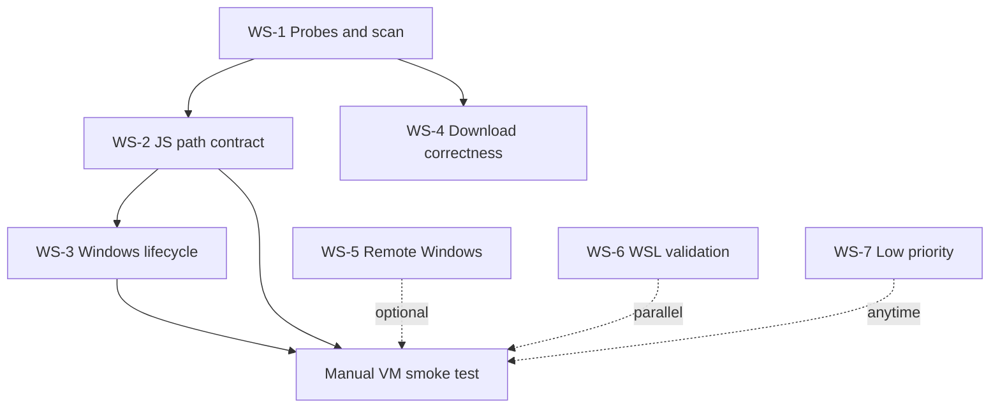

# Cookbook Remediation Plan

**Source:** [dev_log/analysis/2026-06-25-cookbook-path-download-audit.md](../analysis/2026-06-25-cookbook-path-download-audit.md)  
**Success criterion (Windows VM):** Download to `data/huggingface/hub` → Running tab shows **completed** → Serve finds GGUF → llama.cpp serve starts without manual path edits.

---

## Agent pipeline (per workstream)

Every workstream uses the same four roles in sequence. **Do not skip Verify** before opening a PR.

| Role | Responsibility | Output artifact |
|------|----------------|-----------------|
| **Analyst** | Re-read audit IDs + live code; confirm repro on Windows; list touch points, risks, test gaps | `dev_log/plans/ws-{N}-analysis.md` (short) |
| **Scaffolder** | Minimal diff design, test names, API shape if needed; no drive-by refactors | Patch plan + test stubs in analysis file |
| **Executor** | Implement scaffold only; match existing conventions | Code diff |
| **Verifier** | `pytest` focused subset, grep for regressions; update audit register rows to Fixed | Test log + regression notes |

**PR rule:** One workstream = one PR. No mixing WS-A and WS-B in the same PR.

---

## Execution order and dependencies

See remediation plan diagram:

**Merge PR order:** WS-1 → WS-2 → WS-3 (backend truth before JS); WS-4/5 can parallel after WS-1.

**Manual VM smoke (2026-06-26, `127.0.0.1:7000`, AUTH disabled for API test):**

- [x] Server up — health 200, path contract OK (`defaultHubPath` → `data/huggingface/hub`, `localPlatform=windows`)
- [x] Cache scan API works — `GET /api/model/cached` 200 (empty list on fresh VM)
- [ ] Download small GGUF → **blocked:** HF 401 without token (`DOWNLOAD_FAILED` in session log; no model on disk)
- [ ] Running → **completed** — not tested (download never succeeded)
- [ ] Serve tab lists model — not tested
- [ ] Cancel mid-download — inconclusive (PID already gone when kill attempted)

**To finish smoke:** configure HF token in Cookbook Settings (or `HF_TOKEN` for server), rerun download via UI or API with task registered in state, then confirm completed + cache + serve.

---

## PR tracking

| WS | Title | Branch | PR | Status |
|----|-------|--------|-----|--------|
| WS-0 | Coordinator plan | — | — | Done (uncommitted) |
| WS-1 | Backend probe and cache scan | — | — | Done (uncommitted) |
| WS-2 | JS path contract | — | — | Done (uncommitted) |
| WS-3 | Windows lifecycle | — | — | Done (uncommitted) |
| WS-4 | Download correctness | — | — | Done (uncommitted) |
| WS-5 | Remote Windows (optional) | — | — | Done (uncommitted) |
| WS-6 | WSL split-cache | — | — | Done (uncommitted) |
| WS-7 | Diagnostics / low priority | — | — | Done (uncommitted) |

---

## WS-0 — Coordinator

- [x] Analyze — audit consolidated; workstreams defined
- [x] Scaffold — this plan file
- [x] Execute — create tracking doc
- [x] Verify — PR links populated as workstreams land
- [ ] PR merged

**Issues:** (tracking only)

---

## WS-1 — Backend probe and cache scan (Tier A + B)

**Issues:** CB-DL-002, A2-06, A3-01, A2-04, CB-DL-018  
**Owner files:** `routes/cookbook_routes.py`, `routes/cookbook_output.py`, `routes/cookbook_helpers.py`

- [x] Analyze
- [x] Scaffold
- [x] Execute
- [x] Verify — probes + cache scan tests green (coordinator suite: 102 passed)
- [ ] PR merged

---

## WS-2 — JS path contract (Tier A + B)

**Issues:** A5-001, A5-002, CB-DL-008, A5-004, A3-02, A3-03, CB-DL-007  
**Owner files:** `static/js/cookbookServe.js`, `cookbookRunning.js`, `cookbook.js`, `cookbook-hwfit.js`, `cookbookDownload.js`

- [x] Analyze
- [x] Scaffold
- [x] Execute
- [x] Verify — path contract regression tests + `node --check`
- [ ] PR merged

---

## WS-3 — Windows lifecycle (Tier A + B)

**Issues:** CB-DL-001, CB-DL-010, CB-DL-015, A2-01, A2-13, CB-DL-016  
**Owner files:** `src/tool_implementations.py`, `static/js/cookbookRunning.js`, `cookbookDownload.js`, `routes/codex_routes.py`, `routes/shell_routes.py`

- [x] Analyze
- [x] Scaffold
- [x] Execute
- [x] Verify — log path resolver + stop-tree tests; CB-DL-010/015 fixed in `cookbookDownload.js`
- [ ] PR merged

---

## WS-4 — Download correctness (Tier B)

**Issues:** CB-DL-004, CB-DL-005, CB-DL-006, CB-DL-011, CB-DL-012, CB-DL-019, CB-DL-020  
**Owner files:** `routes/cookbook_routes.py`, `src/tool_implementations.py`

- [x] Analyze
- [x] Scaffold
- [x] Execute
- [x] Verify — `_build_dl_pyarg` + agent `local_dir` tests in `test_cookbook_helpers.py`
- [ ] PR merged

---

## WS-5 — Remote Windows runners (Tier B, optional)

**Issues:** CB-DL-003, CB-DL-009, A2-02  
**Owner files:** `routes/cookbook_routes.py`

- [x] Analyze
- [x] Scaffold
- [x] Execute
- [x] Verify — `_safe_env_prefix_ps` tests; stderr merge in status poll
- [ ] PR merged

---

## WS-6 — Path validation and WSL split-cache (Tier C)

**Issues:** A4-1, A2-05, A2-07–10  
**Owner files:** `routes/cookbook_helpers.py`, `core/platform_compat.py`

- [x] Analyze
- [x] Scaffold
- [x] Execute
- [x] Verify — `add_hf_cache` wired in `model_cached` when `is_wsl()`
- [ ] PR merged

---

## WS-7 — Diagnostics, docs, low-priority (Tier D)

**Issues:** A5-005, A5-003, A4-4–7, A2-12–14, CB-DL-014, A3-05–07

- [x] Analyze
- [x] Scaffold
- [x] Execute
- [x] Verify — diagnosis.js Windows cache cmd, `test_hf_download.py`, `.env.example`
- [ ] PR merged

---

## Out of scope (explicit)

- 2026-06-18 pre-flight (CUDA, disk space, build tools) — future plan
- Docker dual-path docs (A4-2, A4-3) — ops/docs only unless Docker user reported
- Full CSS / frontend framework changes
- Splitting `tool_implementations.py` refactor (#3629)
